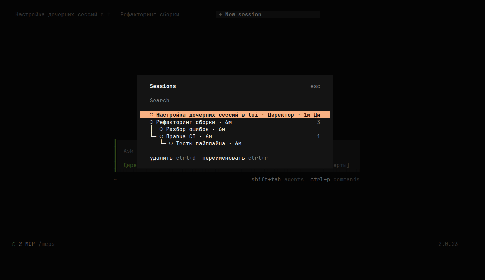
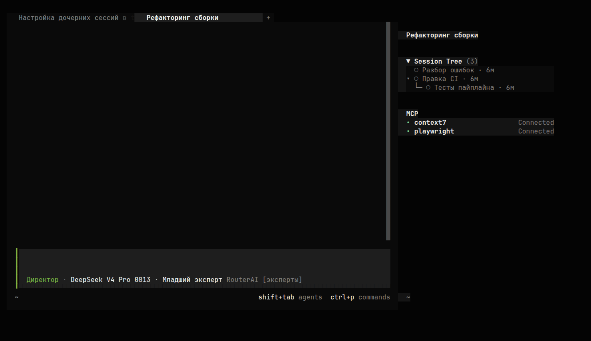

# opencode-session-tree

[](https://github.com/pro100deb/Opencode-Sessions-Tree/actions/workflows/ci.yml)
[](LICENSE)
[](https://opencode.ai/v2/docs/)
[](https://bun.sh)
[](#проверка)

TUI-плагин для OpenCode V2: дерево сессий в боковой панели и окно
`/tree` — тем же диалогом, что и встроенный список `Sessions`.

[Установка](#установка) · [Возможности](#что-делает) · [Управление](#управление-окном) · [Проверка](#проверка) · [Участие](CONTRIBUTING.md) · [Changelog](CHANGELOG.md)

## Скриншоты

Окно `/tree` — дерево сессий с вложенными, поиском и действиями в футере:



Секция **Session Tree** в боковой панели — вложенные сессии текущей, оформлена
как встроенные секции (`MCP`, `Context`):



## Что делает

- **Окно `/tree`** — штатный диалог выбора, как встроенный `Sessions`: строка
  поиска, футер с действиями, навигация. Отличие — дерево: строки рисуются
  префиксами `├─ └─ │`, у кого есть вложенные — с ними, у кого нет — одной
  строкой. Справа у строки — число потомков.
- **Боковая панель** — вложенные сессии текущей, деревом, только чтение.
  Заголовок секции оформлен как встроенные секции ядра (`Context`, `MCP`):
  треугольник `▼/▶`, **жирное** название `Session Tree`, приглушённый счётчик,
  клик по заголовку сворачивает секцию. Имя текущей сессии НЕ дублируется: его
  уже показывает встроенная шапка панели. Если вложенных нет — строка
  `нет вложенных`.

Удаление каскадное на стороне сервера: удалили родителя — ушли и потомки;
выбрали ребёнка — уйдёт только он и его собственная ветка.

## Установка

Плагин подключён в `~/.config/opencode/cli.json`:

```jsonc
{
  "plugins": ["/home/administrator/.config/opencode/tui/session-tree"],
  "keybinds": {
    "session-tree.open": "<leader>y"
  }
}
```

Состав:

| Файл | Назначение |
|---|---|
| `tui.tsx` | вход: команда и слот сайдбара |
| `tree-dialog.ts` | окно «Sessions» с деревом |
| `forest.ts` | чистая логика леса (без TUI и сети) |
| `store.ts` | данные сессий, события, свёрнутые ветки |
| `sidebar.tsx` | боковая панель |
| `test/forest.test.ts` | тесты чистой логики |

## Вызов

| Ввод | Действие |
|---|---|
| `/tree` | открыть окно (алиасы `/sessiontree`, `/stree`) |
| `<leader>y` (по умолчанию `ctrl+x y`) | то же с клавиатуры |
| палитра (`ctrl+p`) → «Sessions» | то же |

Встроенная команда `/sessions` **не переопределяется** — остаётся как есть.

## Управление окном

| Ввод | Действие |
|---|---|
| ввод текста | поиск по названию и агенту |
| `↑ ↓` | выбор |
| `Enter` | открыть сессию |
| `ctrl+d` | удалить сессию (с подтверждением и числом вложенных) |
| `ctrl+r` | переименовать |
| `Esc` | закрыть |

## Управление боковой панелью

- Клик по строке — перейти в сессию.
- Клик по галке `▸ / ▾` — свернуть/развернуть ветку.
- Клик по заголовку `Session Tree` — свернуть/развернуть всю секцию.
- Свёрнутые ветки и свёрнутость секции сохраняются и переживают перезапуск TUI.

## Проверка

```sh
cd ~/.config/opencode/tui/session-tree
bun install
bun test          # 35 тестов: логика леса, язык, склонение
bunx tsc --noEmit # типы
```

## Примечания

- Плагин лежит вне каталога `~/.config/opencode/plugins/`, чтобы его не
  подхватил серверный загрузчик — он объявлен в `cli.json` как TUI-плагин.
- Импорт официального API — `@opencode/plugin/tui`; версия типов совпадает с
  бинарём (`2.0.23`).
- Диагностический лог: `/tmp/opencode/session-tree.log`.
- Тестовый стенд без человека: `tmux` + `opencode --standalone`
  (см. `~/.documentation/opencode.md`, раздел про плагин).

## Репозиторий

Исходный код: <https://github.com/pro100deb/Opencode-Sessions-Tree>

Лицензия — MIT (см. `LICENSE`).
